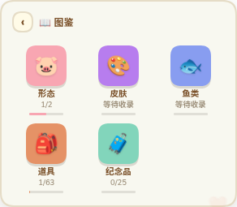
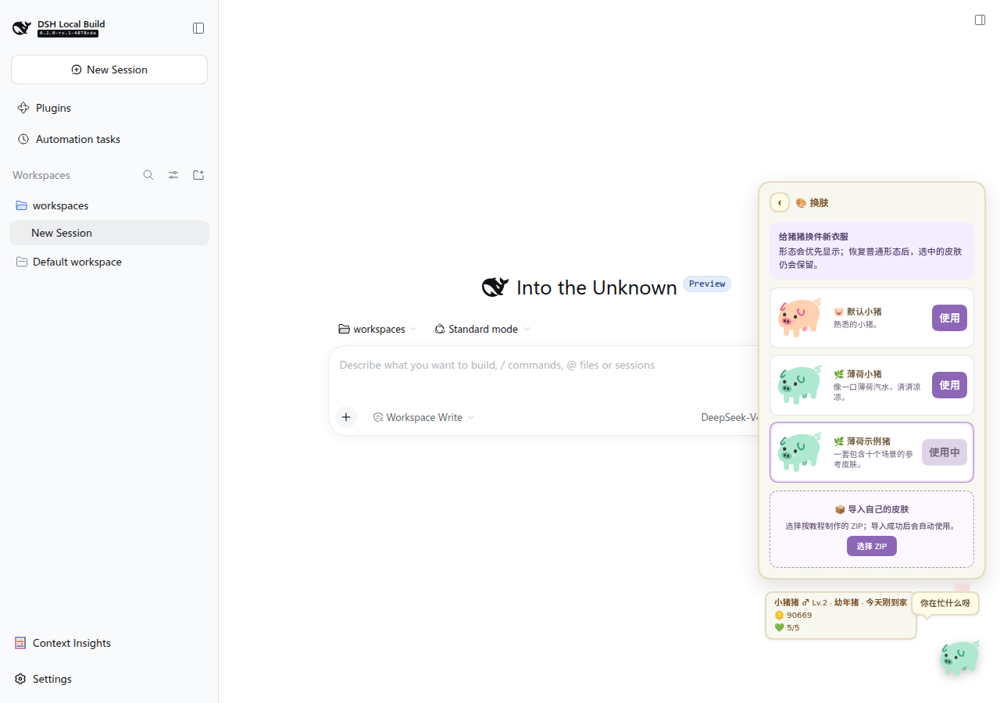

<p align="center"></p>

<h1 align="center">dsh-piggy</h1>

<p align="center">一只住在 <a href="https://github.com/deepseek-ai/deepseek-harness">DeepSeek Harness</a> 里，也能独立住在桌面上的猪。</p>

它会长大、上学、打工、旅行、钓鱼、生病，也会跟你搭话。界面采用动森风格的 App 主菜单，全部玩法都能用鼠标完成。

- **完整养成**：照顾、成长、学习、工作、旅行、收藏和晋升形态
- **桌面版**：Windows、Linux 和 macOS 可独立运行
- **自定义皮肤**：免费切换内置皮肤，也可导入自己的 SVG 皮肤包
- **零 token**：不注册模型工具，不向对话注入宠物状态

<p align="center">
  
  
  
</p>

## 安装

### DSH 插件

```sh
git clone https://github.com/CLICGGER-TYPES/dsh-piggy.git
dsh plugin --profile web add /path/to/dsh-piggy
```

安装后重启 DSH，再刷新页面。

### 桌面版

从 [GitHub Releases](https://github.com/CLICGGER-TYPES/dsh-piggy/releases/latest) 下载对应系统的文件：

- Windows：`setup.exe` 安装版或 `portable.exe` 便携版
- Linux：`AppImage`
- macOS：按芯片选择 `arm64.dmg` 或 `x64.dmg`

macOS 包暂未签名，第一次打开请在访达中右键应用并选择“打开”。更多安装与存档说明见[桌面版指南](docs/guides/desktop.md)。

## 开始玩

右键小猪打开主菜单，左键摸摸它，拖动可以换位置。第一次见到纸盒时连续点三下，把猪接回家。

详细玩法、养成规则和命令见[玩法指南](docs/guides/gameplay.md)。换肤可直接阅读[玩家换肤教程](docs/guides/skins.md)，制作皮肤从[自定义皮肤制作教程](docs/guides/creating-skins.md)开始。

## 文档

- [文档中心](docs/README.md)
- [玩法与养成规则](docs/guides/gameplay.md)
- [桌面版安装、存档与更新](docs/guides/desktop.md)
- [游戏包与桌面外壳怎样更新](docs/guides/updates.md)
- [开发与调试](docs/DEVELOPMENT.md)
- [版本记录](CHANGELOG.md)

## 开发

```sh
npm install --no-save --package-lock=false esbuild@0.28.2 typescript@5.9.3 @types/node@20.19.43
npm run build
npm test
npm run typecheck
```

开发环境、桌面打包、HTTP 接口和目录说明见[开发指南](docs/DEVELOPMENT.md)。

## 致谢与许可

特别感谢 @1nuoiscute 贡献猪猪王原型、恶魔猪、肥猪体型与胖胖猪动作立绘。视觉风格参考 [animal-island-ui](https://github.com/guokaigdg/animal-island-ui)，玩法数值参考资料见 [THIRD-PARTY.md](THIRD-PARTY.md)。项目采用 [MIT License](LICENSE)。
