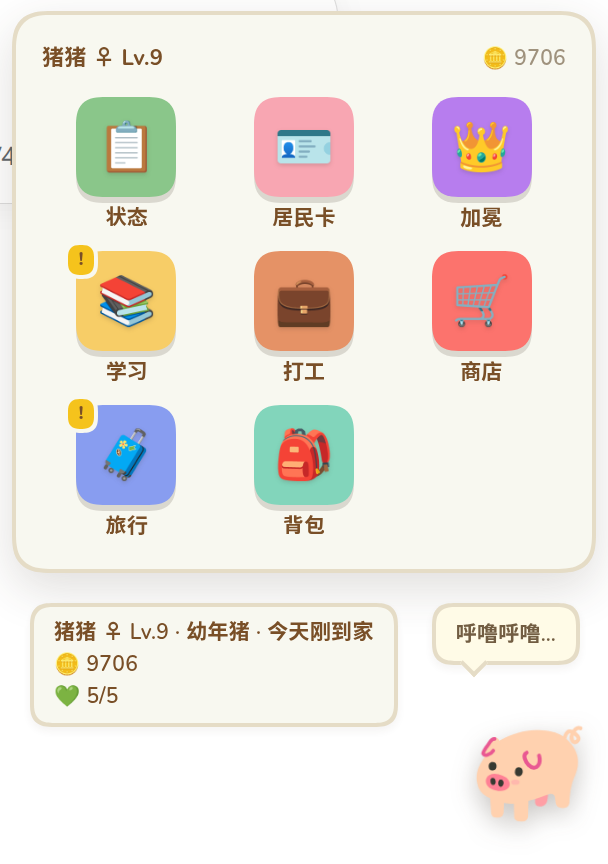
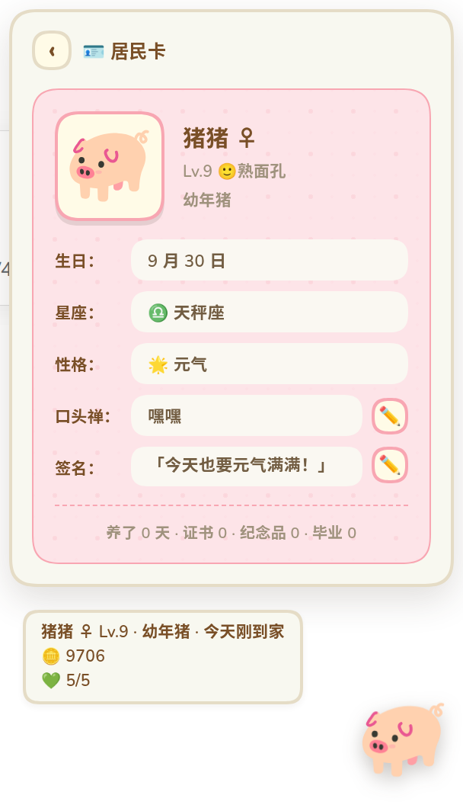
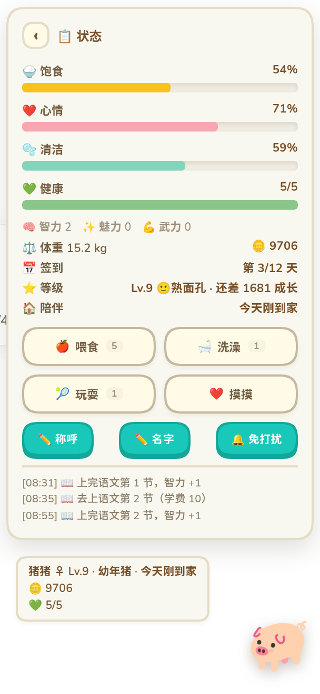
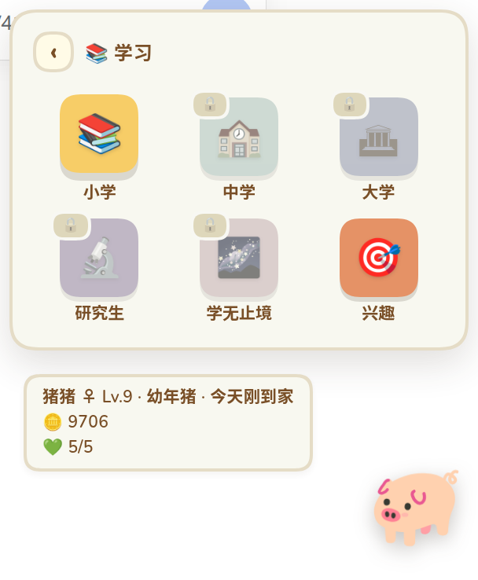
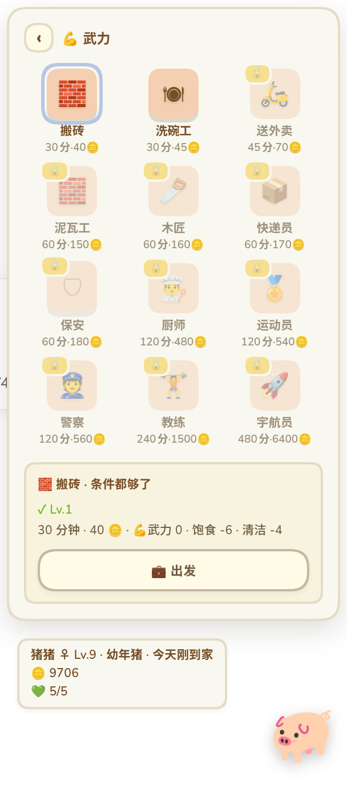
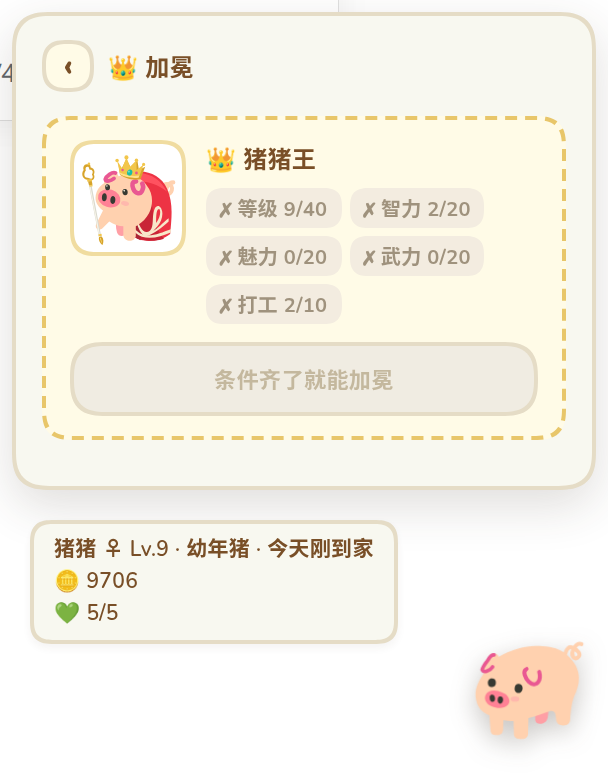
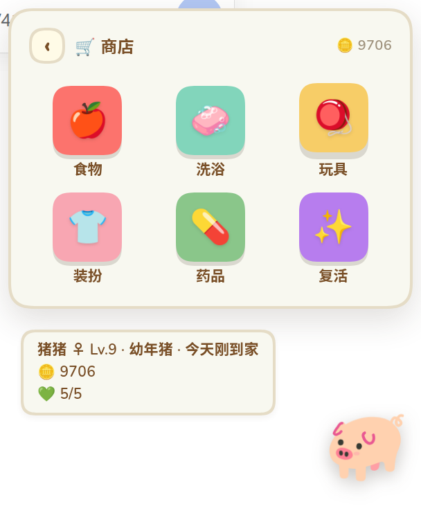
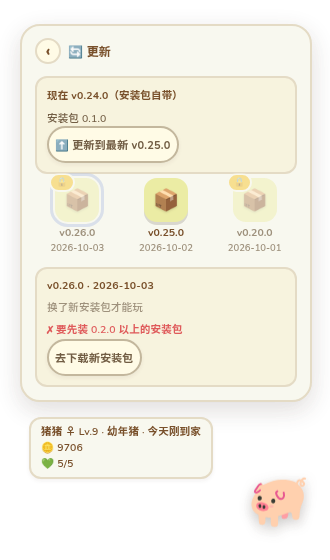

<p align="center">
  
</p>

<h1 align="center">dsh-piggy</h1>

<p align="center">一只住在 <a href="https://github.com/deepseek-ai/deepseek-harness">DeepSeek Harness</a> 里的猪 —— 吃你的真实工作长大，QQ 宠物式的养成。</p>

它会长大、上学、打工、旅行、生病、闹脾气，也会跟你搭话。
玩法照着经典的 QQ 宠物复刻，界面照着动森（[animal-island-ui](https://github.com/guokaigdg/animal-island-ui)）的风格做。

- **点就能玩** —— 九宫格主屏，每个功能是一个 App，不用敲命令
- **零 token** —— 不注册模型工具、不注入上下文，模型不知道它存在
- **零运行时 npm 依赖** —— 纯 JS；游戏规则在独立的共享库 `@dsh-piggy/core` 里，以后的独立版也用同一套

<p align="center">
  
  
</p>

---

## 安装

```sh
dsh plugin --profile web add /path/to/dsh-piggy
```

装完**重启 dsh**（宿主半边在启动时注册命令与路由），然后刷新页面。

## 怎么玩

平时是一只透明背景的小猪，浮在右下角，可以拖到任何地方。

| 操作 | 结果 |
|---|---|
| **右键猪** | 打开 / 收起面板 |
| **左键猪** | 摸摸它 |
| 拖动 | 换个地方待着（会记住） |

一开始是个纸盒，拆开才有猪。打开面板就是**主屏**：顶上是名字、等级、金币，
下面一格格 App，有事的格子左上角会挂个小标签（病了 → 商店，有课能上 → 学习……）。

| App | 里面有什么 |
|---|---|
| 📋 **状态** | 饱食 / 心情 / 清洁 / 健康四条、智力 / 魅力 / 武力三维、喂食洗澡玩耍摸摸。出门、生病、去世的横幅也只在这里 |
| 🪪 **居民卡** | 头像、生日星座、性格、口头禅、签名、收藏数。口头禅和签名可以改，猪说话时偶尔带上口头禅 |
| 📖 **图鉴** | 形态与皮肤用小闪卡收藏；鱼和纪念品用博物馆格陈列，道具用可搜索、可筛选的目录；未解锁形态显示对应剪影和谜面 |
| 🎨 **换肤** | 免费切换内置皮肤，或导入玩家自己的 ZIP 皮肤包；也能从图鉴皮肤页切换 |
| 📚 **学习** | 小学 / 中学 / 大学 / 研究生，9 门课；另有兴趣班，上满 5 次拿证书 |
| 💼 **打工** | 按武力 / 魅力 / 智力分三类，几十种工作，要够等级、课时、证书才能干；点开看缺什么 |
| 🛒 **商店** | 食物、洗浴、玩具、药品、装扮、复活 —— 先选大类，再选商品 |
| 🧳 **旅行** | 郊游到出国，每趟带回一件纪念品 |
| 🎒 **背包** | 买来的东西、纪念品、日记 |
| 🍅 **番茄钟** | 挑 15/25/45 分钟，猪在旁边陪着（它自己进免打扰）；做完 +8 🪙、心情 +6，每天前 8 个给奖励 |
| 🎣 **钓鱼** | 点一下抛竿，看到「❗」及时提竿，再完成有三圈容错的圆盘技能检定；也可自动钓 30/60 分钟 |

所有 App 都是**先点大方块、再点小方块**，左上角「‹」一层层退回主屏。

番茄钟（🍅）开着的时候，主人在忙、猪就趴在旁边：**立绘右上角挂一个小角标**，写着番茄和
剩余时间（猪说话时角标先让位）；专注期间它不说话（自动进免打扰，结束后恢复原样）。倒计时存在存档里，**关面板、刷新、重启都接着走**；
到点由服务端结算，完成时会发一条浏览器通知（没给通知权限就冒个气泡）。

### 调试模式（藏起来的）

主屏最底下那行版本号，**3 秒内连点 7 次**就解锁 🔧 调试 App（第 4 次起猪会告诉你还差几下）：
改数值、跳等级、快进时间、一键拿齐，以及**一键换形态**（猪猪王 / 恢复普通，不看条件）——
等级不够时会顺手把等级顶到那个形态所在的阶段，不然换了形态也看不到立绘变化。

它只存在内存里 —— 刷新或重启就关掉了，调试页顶上还有「关闭调试」。控制台只保留了
`dshPigDev.off()` 这一个开关；以前那个 Ctrl+Shift+D 和 localStorage 记忆已经撤掉了
（用户反馈过「怎么关都关不掉」）。

<p align="center">
  
  
  
  
  
</p>

## 桌面版（开发中）

不装 DSH 也能养：[`apps/desktop/`](apps/desktop/) 是一个 Electron 小程序，双击就有一只猪趴在屏幕右下角，
玩法、界面和 DSH 里完全一样（用的是同一份代码）。

- 窗口就贴着猪那一小块（猪 + 面板 + 气泡的外接矩形，四周留 16px），拖猪＝拖窗口；
  可点区域仍然只算猪和面板，空白角落的点击照常落到桌面。这样 Windows 上不用每帧合成整块全屏透明层
  （以前开着猪整机会卡）
- 存档和 DSH 里那只各养各的；托盘菜单「从 DSH 导入猪…」可以把那只接过来
- 托盘菜单还有：藏起来 / 开机自启 / 退出；主屏也有「👋 退出」
- Linux 的 GNOME 默认不显示托盘图标，要托盘的话装「AppIndicator and KStatusNotifierItem Support」扩展；不装也能用主屏的「退出」
- 桌面版没有「吃你的真实工作」，只靠时间慢慢长

```sh
cd apps/desktop
npm install
npm start              # 直接跑
npm run dist:linux     # 打 AppImage（dist/）
npm run dist:win       # 打 Windows 安装包
npm run dist:mac       # 打 macOS dmg（只能在 Mac 上打；发版时由 GitHub 的 macOS 构建机打）
```

Linux 上默认走 XWayland（Wayland 不让窗口给自己裁形状）。
窗口里的猪停在右下角 16px 处；位置（窗口坐标）记在 `userData/window.json`，下次开机照旧。

**更新**：桌面版主屏多一个 🔄 更新 App ——

- 「更新到最新」一键换到 GitHub 上最新的版本；也可以在版本列表里挑一个换过去
- 换完猪重启一下（约 1 秒）就好；换之前自动备份存档，还能「回到上一个版本」
- 换的只是游戏本身（几百 KB 的游戏包，下载后校验 sha256），不用重装
- 太旧、读不了现在存档的版本是灰的；要更新安装包本身的版本会带你去下载页

<p align="center"></p>

**发版**：把根目录 `package.json` 的 version 改好，推一个同名标签（如 `v0.25.0`），
GitHub Actions（[`.github/workflows/release.yml`](.github/workflows/release.yml)）会跑测试、
生成游戏包、打 Linux AppImage、Windows 安装包和 macOS dmg，一起挂到 Release 上。
macOS 包没有签名：第一次打开要右键 →「打开」，或者执行 `xattr -dr com.apple.quarantine /Applications/dsh-piggy.app`。
macOS 不支持只让窗口一部分可点，猪和面板四周约 16px 的透明边会挡住下面的点击。

## 养成规则

> 具体数值以 [`packages/pet-core/src/data/`](packages/pet-core/src/data/) 与 [CHANGELOG](CHANGELOG.md) 为准，这里只讲规则。

- **成长**：吃你的真实工作长大（每天有上限，06:00 换天）。照顾得好长得快。
  等级封顶 60，Lv10 长成青年、Lv40 长成成年；没有老死，大约半年养到满级。
- **晋升形态**：猪猪王需要 Lv40、三维各 20、本代完成打工 10 次；恶魔猪需要 Lv40、武力与魅力各 20、本代玩耍 20 次。去商店「✨ 晋升」买 👑 王冠（3000 🪙）或 😈 恶魔契约（6666 🪙），在背包点「加冕」或「签约」。条件不齐会列出差额，道具不会消耗。主屏 📖 图鉴会显示形态条件进度；`/pig crown` 也要先有王冠。已加冕的旧猪保持原形态。
- **图鉴**：第一次拿到与累计获得次数会写进存档；商店、礼包、外出掉落、调试给予都算。形态与皮肤采用三列小闪卡，未解锁形态保留 SVG 剪影与谜面，点亮后才有倾斜和流光；鱼和纪念品采用博物馆格，道具采用可搜索、可按用途筛选的紧凑目录。点开条目会进入独立详情页，换猪时收藏跟着主人保留。
- **换肤与自定义皮肤**：皮肤不在商店出售，也不是背包道具。主菜单「🎨 换肤」和「📖 图鉴 → 皮肤」都能切换；玩家可导入自己的 ZIP，最少 5 张 SVG、完整 10 张。格式、制作步骤和可直接改的示例见 [自定义皮肤导入教程](docs/CUSTOM-SKINS.md)。晋升形态优先显示，恢复普通形态后会回到之前选择的皮肤。
- **体型**：实际体重达到当前等级理想体重的 1.3 倍会变「圆润」，达到 1.6 倍会变「胖胖」；普通默认猪会换成胖胖立绘。玩耍、打工和每日自然代谢只减少超出理想体重的部分，不会减过头。
- **钓鱼**：真实时间会改变鱼群。点击一次即可抛竿；提竿后要在圆盘指针进入绿色区域时点击或按空格，黄色完美区一次推进两格。点早或点晚可以继续等下一圈，连续空三圈鱼才会跑；难鱼转得更快、区域更窄，并要求更多次连续命中。钓到的鱼可放进背包喂猪或卖掉，图鉴记录钓到次数与最大尺寸；自动钓鱼每天最多两次，收益按 70% 结算。
- **照顾**：喂食、洗澡、玩耍都要花背包里的道具，点按钮会弹出背包让你挑；摸摸免费。
- **生病**：长期饿着、脏着会有几率生病。5 条病链，每条一期比一期重，
  得吃**对症**的药；吃错会加重。实在不会治可以花钱看医生。健康归零就走了。
- **死了**：用还魂丹救回来，等级、金币、收藏都在；或者领养一只新的。
- **外出**：打工、上课、旅行时猪不在家，照样消耗；随时能叫回来。
  回来时可能顺手带点东西。
- **日常**：每天签到，在线每小时一个礼物，日记记着它这些天干了什么。
- **说话**：猪会主动搭话、回应你的照顾，可以点选项回它。嫌吵就开免打扰；
  也可以让它换个称呼叫你。

**所有结算都按时间戳补算**，没有常驻定时器：关掉 DSH 期间猪照样在饿、
工照样会打完，重开时一次结清并弹公告。随机事件用存档里的种子，重开不会刷出不同结果。

## 存档

`$DSH_HOME/dsh-piggy/state.json` —— 原子写（临时文件 → fsync → rename）+ 节流。
老版本存在 `$DSH_HOME/dsh-pig/` 的存档，第一次启动时会自动搬过来（旧目录改名保留，不删）。
存档格式升级时逐级迁移，**升级前自动备份**为 `state.json.v<旧版本>-backup-<时间>`。

## 配置

```yaml
- id: dsh-piggy
  name: dsh-piggy
  config:
    command: pig                              # 改斜杠命令名
    statePath: /abs/path/to/state.json        # 改存档位置
```

## 命令（不想点鼠标时才用）

```
/pig                                   状态卡
/pig hatch | adopt                     拆纸盒 / 领养新猪
/pig feed | bathe | play | pet         照顾
/pig study <科目>   /pig interest <兴趣班>   /pig work <工作>   /pig trip <目的地>
/pig calloff                           叫回来
/pig shop | buy <物品> | use <物品> | sell <纪念品> | wear <装扮>
/pig reply <序号>                      回它的话
/pig weigh | name <名字> | about
```

## HTTP 接口

```
GET  /dsh-piggy/state   完整快照
POST /dsh-piggy/act     执行操作（操作表见 routes.js 的 OPERATIONS，命令与面板共用）
```

请求体上限 2 KB，状态响应**不含任务标题**。

> ⚠️ 插件通过 `ctx.webServer.register()` 注册的路由**不走主应用的鉴权围栏**
> （DSH 既有行为，其它插件同样如此）。服务只绑 `127.0.0.1`。

## 视觉

配色、圆角、边框、阴影照
[guokaigdg/animal-island-ui](https://github.com/guokaigdg/animal-island-ui) 的 design-system 实现：
奶油羊皮纸底、暖棕文字和边框、薄荷青主按钮带 3D 底边、彩色圆角方块、点点纹理的居民卡。
token 声明在组件根节点而**不是 `:root`**，不污染宿主页面。

数值与命名参考了两份公开资料 ——
[xuemian168/qqpet_automation](https://github.com/xuemian168/qqpet_automation)（逆向分析）
与 [ice-cream-headache.github.io](https://github.com/ice-cream-headache/ice-cream-headache.github.io)（界面截图）。
**没有使用任何原版代码或美术资源**，详见 [THIRD-PARTY.md](THIRD-PARTY.md)。

## 项目结构

```text
dsh-piggy/
├── package.json          插件清单与 build / typecheck / test 脚本
├── cordis.patch.yml      profile 配置层
├── core.js / data.js     根目录再导出入口，兼容既有导入
├── packages/pet-core/   共享领域库 @dsh-piggy/core，纯 JavaScript、无 IO
│   └── src/             core/ 领域规则与 data/ 静态游戏表
├── store.js / store/     存档读写、原子写与节流
├── index.js              宿主组装入口
├── snapshot.js           面板快照
├── commands.js           /pig 命令
├── routes.js             HTTP 路由
├── render.js             文案与 ASCII 立绘
├── src/client/           客户端源码：场景、交互、样式与 tabs/*
├── client.js             生成的单文件客户端产物，随仓库提交
├── scripts/
│   ├── build-client.mjs   esbuild 打包入口
│   └── typecheck.mjs      JavaScript 类型检查入口
├── test/                 游戏逻辑、宿主、客户端、存档、构建与规范检查
├── tools/                preview.html / art.html 等浏览器预览台
├── assets/               SVG 立绘
├── docs/                 设计、编码规范、美术需求与开发记录
├── CHANGELOG.md          版本变更历史
├── THIRD-PARTY.md        第三方致谢与许可
└── LICENSE              MIT
```

## 从源码开发

需要 **Node.js ≥20**（自带 npm）、Git 和浏览器。运行已提交的插件产物无需开发工具；
**构建源码和运行完整检查**需要 esbuild、TypeScript 与 Node 类型定义。
仓库的 `package.json` 当前没有声明这些开发依赖，单独克隆时先在本地安装：

```sh
git -c core.autocrlf=false clone https://github.com/CLICGGER-TYPES/dsh-piggy.git
cd dsh-piggy
npm install --no-save --package-lock=false esbuild@0.28.2 typescript@5.9.3 @types/node@20.19.43
npm run build
npm run typecheck
node --test
```

准备贡献时，先 Fork，再把 clone 的地址换成自己的 Fork。
`core.autocrlf=false` 让此次克隆保留仓库的 LF 换行；构建产物守卫逐字节比较
`client.js`，Windows 自动转换成 CRLF 会影响这个检查。
`--no-save --package-lock=false` 只安装本地工具，不修改依赖清单、不生成锁文件；
`node_modules/` 已被 Git 忽略。安装 esbuild 时 npm 会运行它的安装脚本，以准备当前平台的构建工具。

上面的版本组合已经验证可构建和检查。这里固定 TypeScript 5.9.3：
当前检查脚本没有显式指定 `strict`，而 [TypeScript 6.0 起默认启用 strict](https://www.typescriptlang.org/docs/handbook/release-notes/typescript-6-0.html#strict-is-now-true-by-default)，
直接安装新版会产生额外类型错误。升级检查工具应另行验证。

- **客户端**：修改 `src/client/`，运行 `npm run build`，提交生成的 `client.js`。
  不要直接编辑 `client.js`；DSH 加载它，`test/bundle.test.js` 检查它与源码一致。
- **游戏逻辑与数据**：修改 `packages/pet-core/src/core/` 或 `packages/pet-core/src/data/`；
  存档相关代码在 `store/`，新增存档结构还需在共享库 `core/upgrades.js` 追加迁移。
  领域层保持无 IO，时间必须由参数传入。
- **提交前**：运行 `npm run typecheck` 和 `node --test`。
  UI 改动还要在真实浏览器中确认；约定见 [docs/CONVENTIONS.md](docs/CONVENTIONS.md)。

提示 `esbuild not found` 或 `no tsc found` 时，确认已在仓库根目录执行工具安装命令。
也可通过 `DSH_PIG_ESBUILD`、`DSH_PIG_TSC`、`DSH_PIG_TYPES` 指向已有工具；
具体解析规则见 `scripts/`。

## 看界面（不用连宿主）

直接用浏览器打开 `tools/preview.html` 即可；仓库已包含 `client.js`，
只看现有界面无需安装开发工具。修改客户端源码后，先重新构建再刷新预览页。

Linux：

```sh
xdg-open tools/preview.html
```

Windows 的操作见下一节。预览台伪造 `window.__ModuleLoader__` 和 `fetch`，
不启动 DSH 就能看到主屏和各个 App。它使用示例快照：
**预览中的操作不会验证真实宿主的金币扣除、活动结算或存档读写**。

浏览器开发者工具的 Console 中可以使用：

```js
window.pigStub.setOpen(true)   // 展开；false 收起
window.pigStub.tab('study')    // 打开学习 App
window.pigStub.state()        // 查看当前布局
window.dshPigDev.off()        // 关闭调试（打开要在主屏连点版本号 7 次）
```

`tools/art.html` 可查看立绘，`tools/stages.html` 可查看生命周期形态示意。
这些预览页使用示例数据，当前阶段与数值以 `packages/pet-core/src/data/` 和实际宿主快照为准。

> 假 DOM 没有 CSS 引擎。曾经出现过 JS 正确设置 `hidden = true`、测试通过，
> 浏览器却仍显示被隐藏元素的情况。**断言标志位证明不了元素不可见**，要在真实浏览器确认。

## Windows 入门（PowerShell）

先安装 Git 与 Node.js ≥20，重新打开 PowerShell，在希望保存项目的目录执行：

```powershell
git --version
node --version
npm.cmd --version
git -c core.autocrlf=false clone https://github.com/CLICGGER-TYPES/dsh-piggy.git
Set-Location .\dsh-piggy
```

`npm.cmd` 调用 npm 的 Windows 命令入口，避免 PowerShell 把 `npm` 解析成
`npm.ps1` 后因执行策略被拒绝；无需修改系统执行策略。
如果已按上一节克隆，进入那个目录即可，不用重复 clone。

只看界面，用默认浏览器打开：

```powershell
Start-Process -FilePath (Resolve-Path .\tools\preview.html).Path
Start-Process -FilePath (Resolve-Path .\tools\art.html).Path
```

准备改源码时，在仓库根目录安装开发工具并检查：

```powershell
npm.cmd install --no-save --package-lock=false esbuild@0.28.2 typescript@5.9.3 @types/node@20.19.43
npm.cmd run build
npm.cmd run typecheck
node --test
```

如果已安装 DSH CLI，且 `dsh` 在 PATH 中，可把本地仓库加入 **web profile**：

```powershell
dsh plugin --profile web add (Resolve-Path .).Path
```

安装后重启对应的 DSH 宿主，再刷新页面。**web 与 desktop 是不同 profile**；
这里的命令只针对 web，不代表 DSH Desktop 的安装步骤。
源码改完、构建完成后也要重启真实宿主，才能重新组装客户端 bundle；
开发者面板可以查看宿主快照中的构建版本。

## 文档

- [CHANGELOG.md](CHANGELOG.md) —— 版本变更历史
- [docs/CONVENTIONS.md](docs/CONVENTIONS.md) —— 编码、验证与提交规范
- [docs/REFACTOR-PLAN.md](docs/REFACTOR-PLAN.md) —— 源码分层与构建说明
- [docs/DESIGN.md](docs/DESIGN.md) —— 为什么是这样：参考调研、数值映射、架构决策
- [docs/PROCESS.md](docs/PROCESS.md) —— 怎么变成这样：每一轮反馈、每个 bug、每条验证证据

## 许可

MIT。数值与部分名称参考自公开的逆向资料，**未包含任何原版代码或美术资源**；
立绘是作者提供的原创矢量图。QQ 宠物是腾讯的商标，本插件与其无任何关联、
亦未获其授权。第三方致谢与许可见 [THIRD-PARTY.md](THIRD-PARTY.md)。
