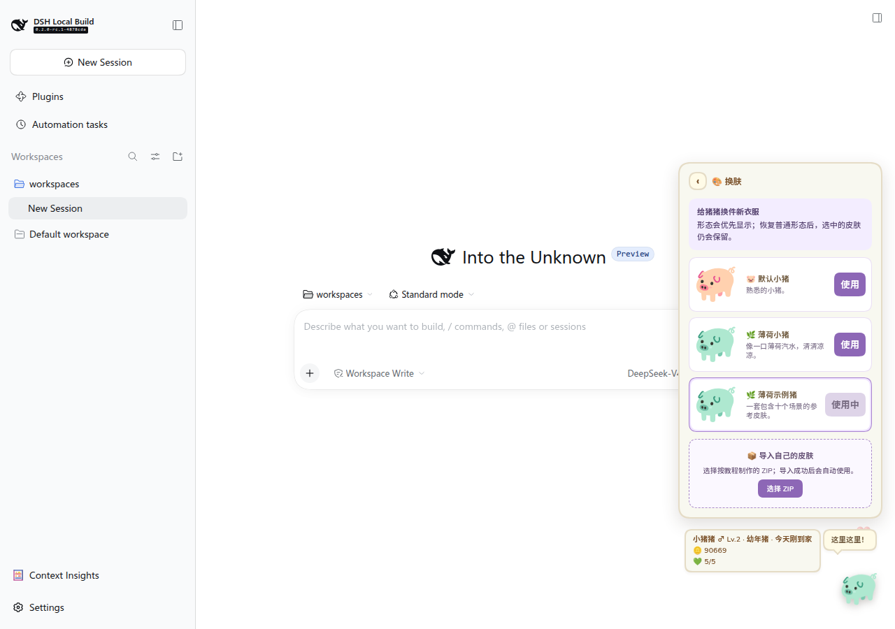

# 换肤与导入自定义皮肤

[文档中心](../README.md) · [制作自己的皮肤](creating-skins.md) · [格式规范](skin-pack-format.md)

皮肤不进商店，也不会进入背包。侦探猪、天使猪、海盗猪和巫师猪可以直接使用；厨师猪和宇航员猪是职业外观，分别在完成一次对应工作后解锁。内置外观和玩家导入的皮肤共用同一个换肤页面。

## 切换皮肤

1. 打开猪猪面板。
2. 在主菜单选择 **🎨 换肤**。
3. 找到想用的外观，点击“使用”。未解锁职业外观会显示需要完成的工作。

也可以进入 **📖 图鉴 → 皮肤**，打开已经获得的外观后切换。职业外观未解锁时是灰色剪影和提示。选择结果会保存，刷新或重启后仍然有效。老存档没有保存过去每一种工作的完成记录，过去做过对应工作的玩家再完成一次即可解锁。

## 导入别人制作的皮肤

1. 准备一个符合规范的 `.zip` 皮肤包。想先试用可以下载[完整示例 ZIP](../examples/skin-pack-example.zip)。
2. 打开 **🎨 换肤**，滚动到“导入自己的皮肤”。
3. 点击“选择 ZIP”，选择皮肤包。
4. 导入成功后，新皮肤会立即启用，并出现在换肤 App 和图鉴中。

## 更新已经导入的皮肤

让新皮肤包的 `skin.json` 使用与旧皮肤相同的 `key`，再次导入即可更新。皮肤名称、作者、介绍和图片都会以新包为准。

## 为什么换了皮肤却仍显示猪猪王或恶魔猪

显示顺序固定为：

1. 当前晋升形态；
2. 当前选择的皮肤；
3. 默认小猪。

晋升形态会暂时盖住皮肤，但不会清除选择。恢复普通形态后，之前选择的皮肤会重新出现。

## 常见导入错误

| 提示 | 怎么处理 |
|---|---|
| ZIP 只能在根目录放文件 | 压缩 `skin.json` 和 SVG 文件本身，不要压缩外层文件夹 |
| 缺少 `idle.svg` 等文件 | 补齐五张必需图片，文件名必须完全一致 |
| 必须使用 `viewBox="0 0 64 64"` | 修改 SVG 根元素的 `viewBox` |
| 含有不允许的外链、文字、脚本或滤镜 | 把文字转为路径，移除位图、外链、脚本、渐变和滤镜 |
| key 与内置皮肤重名 | 换一个只含小写字母、数字和短横线的 `key` |
| ZIP 不能超过 2 MB | 简化 SVG 路径，并移除编辑器写入的无用数据 |

准备制作自己的皮肤时，继续阅读[自定义皮肤制作教程](creating-skins.md)。
