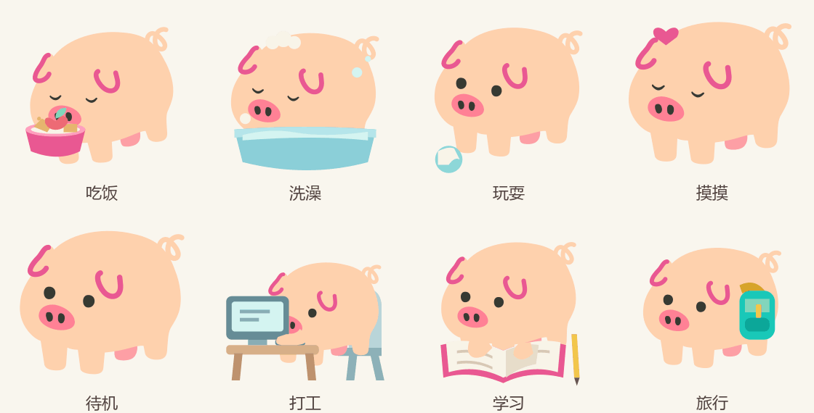

# 肥猪与体重系统

本次只有普通与肥猪两档，立绘以贡献者确认的参考造型为基础。肥猪是可恢复的外观，不增加疾病风险，也不改变属性、收益或成长速度；王、恶魔和非默认皮肤保留自己的外观。

## 参考体重与门槛

孵化为 1360 g；现有喂食每次增重 90 g、苹果恢复饱食 22、饱食每小时自然下降 4.8、基础成长每小时 100。用正常补充饱食作为参考，增重率为每成长值 `90 × 4.8 ÷ 22 ÷ 100` g。

参考体重 = `1360 + min(成长值, Lv60 所需成长值) × 增重率`，取整到克。它随等级内的成长进度连续变化，满级以后固定；不会因为升一级突然切换体型。这是游戏数值，未采用现实动物的体重标准。

| 等级 | 参考体重 | 变胖门槛（≥ 1.6 倍） | 恢复门槛（≤ 1.35 倍） |
|---|---:|---:|---:|
| 1 | 1.4 kg | 2.2 kg | 1.8 kg |
| 10 | 3.8 kg | 6.0 kg | 5.1 kg |
| 20 | 10.9 kg | 17.5 kg | 14.8 kg |
| 40 | 39.7 kg | 63.5 kg | 53.6 kg |
| 60 | 87.6 kg | 140.2 kg | 118.3 kg |

表格为显示精度；判断使用克级原值。普通猪达到上门槛变胖，已经胖的猪要达到下门槛才恢复，中间区间保持先前体型。实际显示尺寸为原生命阶段的 1.5 倍：幼年 81px、青年 90px、成年 102px。

## 减重

减重只减少超过参考体重的部分，体重本来低于参考值时不会被抬高。

- 成功玩耍：多余体重 × 0.97。每天前十次成功玩耍可减重，超过十次仍保留原有玩耍效果；冷却、外出、死亡等拒绝不计数。游戏日沿用当地时间 06:00 的分界。
- 完成打工：多余体重 × `0.97 ^ 实际完成小时数`。半小时同样有效，未完成、重复查询不会额外给减重。
- 自然代谢：多余体重 × `0.98 ^ 经过猪天数`，连续结算，离线同样推进；时间倍率与现有成长时间一致。纸盒、死亡期间不推进。
- 保留现有食物、真实对话和工具调用的增重规则，不能据简化模型承诺固定几天恢复。

## 存档与素材

存档 v13 增加 `bodyWeight: {isFat, playDay, plays}`，保存中间区间的体型和今日运动次数。v12 及更早版本逐级升级，实际体重、等级、形态、背包、属性不丢失；缺失和手改字段会清洗。复活保留记录，领养/重置新一代清空。

九张 64×64 透明 SVG：待机、放松、吃饭、洗澡、玩耍、摸摸、打工、学习、旅行。全部保持参考图配色与基础轮廓。游戏复用现有动作素材切换和 CSS 动画；`tools/pig-weight-preview.html` 展示独立分层动画（咀嚼、泡泡、滚动皮球、前蹄打字、迈短腿），两者的动画实现不同。

## 验证记录

- 完整自动测试：417 项全部通过；覆盖进入/退出边界、每日上限、冷却拒绝、06:00 换日、离线复利、工作完成结算、存档重载与 v13 迁移。
- `npm run build` 与 `npm run typecheck` 通过，提交生成的客户端产物。
- 隔离 HTTP 实例使用真实核心、存档、路由与构建后的客户端；浏览器确认成年肥猪约 102px、学习动作 SVG 正常加载、状态页目标和次数可见，无控制台错误。贡献者已确认造型与动作。
- `npm pack` 检查九张 SVG、核心模块和客户端均进入发布包，并从解包产物运行肥猪/玩耍/恢复体型检查。
- 未验证正式 DSH 或 Electron 安装运行；动态分层动画仅在独立预览页展示。
